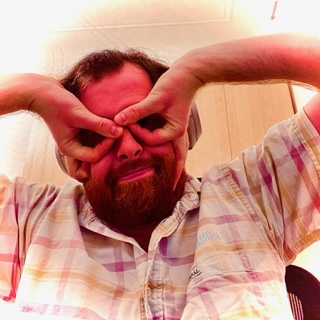

# Hi there, I'm LordGordon! :wave:

> Do I contradict myself? 
> Very well then I contradict myself, 
> (I am large, I contain multitudes.) 
>
> — Walt Whitman

## Something about me

I'm from [Cremona, Italy](https://www.wikiwand.com/it/Cremona), the city of salame, torrone, mostarda, and violins 
:violin:&nbsp;. I'm currently living in Milano, a city I really enjoy. My fav colour is 
usually around this hue ([more here](https://duckduckgo.com/?q=color+picker+%230885c9&ia=answer)).

I like to read :books:&nbsp; [books](https://www.wikiwand.com/en/Hyperion_(Simmons_novel)) (mostly fiction) and graphic 
novels ([manga too](https://www.wikiwand.com/en/Jiro_Taniguchi)). I love watching :tv: &nbsp; 
[good](https://www.wikiwand.com/en/The_Wire) [TV](https://www.wikiwand.com/en/The_Americans) 
[shows](https://www.wikiwand.com/en/BoJack_Horseman) and 
[&nbsp; :clapper: movies](https://www.wikiwand.com/en/Stanley_Kubrick_filmography). I cannot resist a 
[Miyazaki anime](shorturl.at/vwDV2). When I'm not reading or watching a movie I may be walking around the city or going 
out to theatre for a nice show. Otherwise, you may find me enjoying a 
[good coffee &nbsp;:coffee:&nbsp;](https://www.orsonerocoffee.it/).

I don't even dare to start explaining what food I like. AFAIK there is not enough space on this server. You asked about 
music? Well, try to find me without my headphones on :notes:&nbsp;.

## I build with

## Stay in touch!

## Before you go...

> Le Poète est semblable au prince des nuées 
> Qui hante la tempête et se rit de l'archer; 
> Exilé sur le sol au milieu des huées, 
> Ses ailes de géant l'empêchent de marcher. 
>
> — Charles Baudelaire
> 
